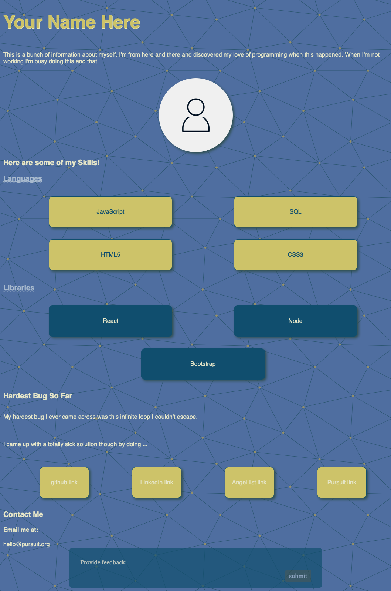

# CSS Selectors Lab

In this lab, you'll have the opportunity to design a personal webpage. The content already exists -- you just need to style it to the best of your ability!

---

## Lab Setup

### Getting started

1. Fork and clone this repository.

1. Navigate to the `settings` tab on GitHub, then choose `Pages` from the menu. Configure the `Build and Deployment` to have a `Source` of `Deploy from a branch` and select the `main` branch for deployment. Deployments can take a few minutes, so get started on the lab, and then be sure to check the deployment after you have made a few commits.

1. Open up the repository in VSCode. Follow the instructions below to complete the Lab.

## Instructions

To complete this lab, you will need replace the `p` selector to another selector that selects the correct element so that your page matches the example.

You are free to add additional `class` and `id` attributes to assist with selecting the correct element. Otherwise the HTML is complete and you do not need to add or remove elements.

> **Note**: You will see rules that you have not yet learned and that's ok! Part of being a developer is learning through looking at other people's work and picking up what you don't yet know.

### Hints

- Look for rules for text elements like:

  - color
  - text-align
  - font-weight

To help you figure out if you are styling a text element.

- Look for rules for list items like:
  - list-style

To help you figure out if you are styling elements related to lists.

- Look for rules for box elements like:
  - margin
  - padding
  - box-shadow
  - width

To help you figure out if you are styling a box element

Once your complete with the above tasks, your page should look something like the image below.

## Bonus

Replace the generic text in the `index.html` file to be about you.
